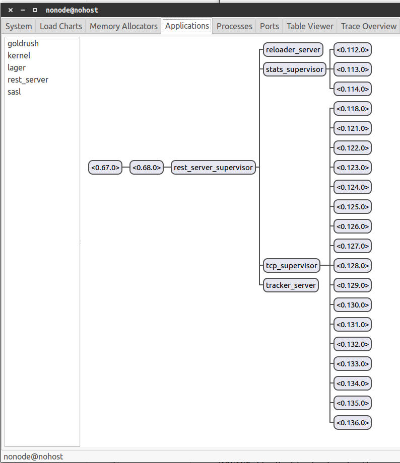

brunhilde (tested with Erlang OTP R19)
=======


brunhilde is a minimal Erlang/OTP web server,
designed for rapid prototyping and hackathons/coding
competitions. As simple as possible, so that it can
quickly be modified or debugged. It is not designed
to provide high performance or be used in production.

#News:
Version 1.5.4 supports TLS (for HTTPS).

#Dependencies:
* rebar3 (https://www.rebar3.org/)
* lager: fetched from rebar3
* jsx: fetched from rebar3
* erlydtl: fetched from rebar3

#Usage:

To start brunhilde standalone, do:
```
make build start
```

To embed brunhilde in another OTP application, see:
[brunhilde_ext](https://github.com/ksallberg/brunhilde_ext).

For an example of a small (but covering POST, GET, redirects, etc), see:
[musiklistan](https://github.com/ksallberg/musiklistan).


#Dialyzer:
make dialyzer (requires existing PLT)

#Running virtual servers/apps:

Virtual servers are defined in servers/ and have to use the
rest_handler behaviour. Give a list of virtual servers to
start in brunhilde.conf.

For example:
```erlang
#{collect_stats  => true,
  start_observer => false,
  start_debugger => false,
  servers =>
   [#{name      => battleship,
      port      => 28251,
      workers   => 10,
      transport => http},
    #{name      => helloworld,
      port      => 5030,
      workers   => 5,
      transport => http},
    #{name      => stats,
      port      => 8080,
      workers   => 2,
      transport => {https,
                    "/some/cert.pem",
                    "/some/privkey.pem",
                   }
     }
   ]}.
```

#Supervisor tree:

