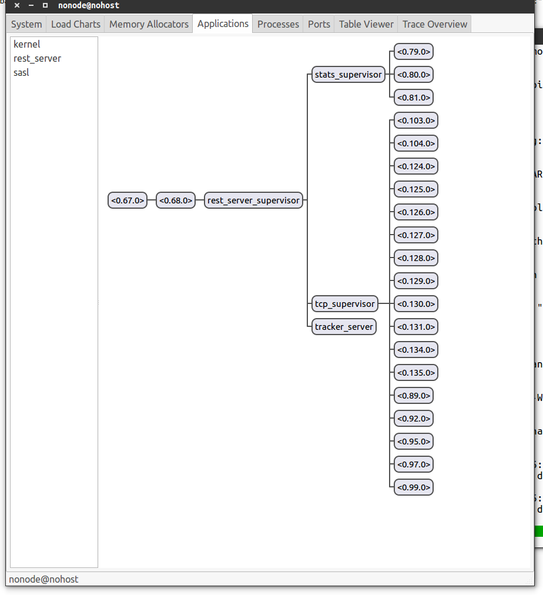

brunhilde (tested with Erlang OTP R19)
=======


brunhilde is a minimal Erlang/OTP web server,
ideal for rapid prototyping and hackathons/coding
competitions. It is designed to be as simple as
possible, so that it can quickly be modified or
debugged. It is not designed to provide high
performance or be used in production.

#Dependencies:
* rebar3 (https://www.rebar3.org/)
* lager: fetched from rebar3
* jsx: fetched from rebar3
* erlydtl: fetched from rebar3

#Usage:

```
make build start
```

#Dialyzer:
make dialyzer (requires existing PLT)

#Running virtual servers/apps:

Virtual servers are defined in servers/ and have to use the
rest_handler behaviour. Give a list of virtual servers to
start in brunhilde.conf.

For example:
```erlang
#{collect_stats  => true,
  start_observer => false,
  start_debugger => false,
  servers =>
   [#{name     => battleship,
      port     => 28251,
      workers  => 10},
    #{name     => helloworld,
      port     => 5030,
      workers  => 5},
    #{name     => stats,
      port     => 8080,
      workers  => 2}
   ]}.
```

#Supervisor tree:

